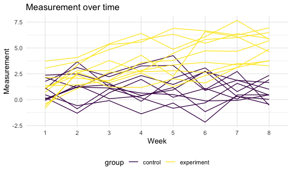
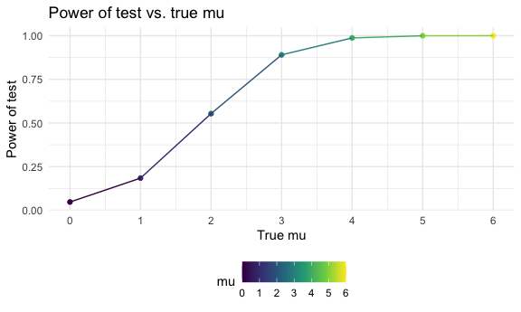
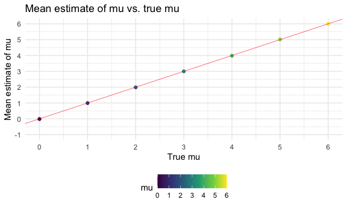
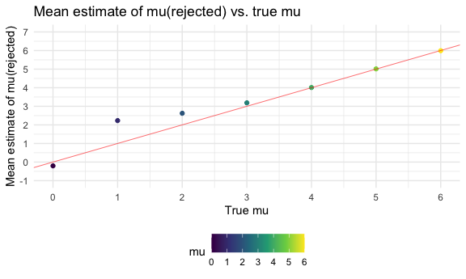

Homework 5
================
Jingyi Zhang

## Problem 1

Read in the data.

``` r
homicide_df =
  read_csv("./homicide_data/homicide-data.csv") %>% 
  mutate(
    city_state = str_c(city, state, sep = "_"),
    resolved = case_when(
      disposition == "Closed without arrest" ~ "unsolved",
      disposition == "Open/No arrest"        ~ "unsolved",
      disposition == "Closed by arrest"      ~ "solved"
    )
  ) %>% 
  select(city_state, resolved) %>% 
  filter(city_state != "Tulsa_AL")
```

    ## Parsed with column specification:
    ## cols(
    ##   uid = col_character(),
    ##   reported_date = col_double(),
    ##   victim_last = col_character(),
    ##   victim_first = col_character(),
    ##   victim_race = col_character(),
    ##   victim_age = col_character(),
    ##   victim_sex = col_character(),
    ##   city = col_character(),
    ##   state = col_character(),
    ##   lat = col_double(),
    ##   lon = col_double(),
    ##   disposition = col_character()
    ## )

<br />

Let’s look at this a bit.

``` r
aggregate_df =  
  homicide_df %>%
  group_by(city_state) %>%
  summarize(
    hom_total = n(),
    hom_unsolved = sum(resolved == "unsolved")
  )
```

    ## `summarise()` ungrouping output (override with `.groups` argument)

``` r
aggregate_df
```

    ## # A tibble: 50 x 3
    ##    city_state     hom_total hom_unsolved
    ##    <chr>              <int>        <int>
    ##  1 Albuquerque_NM       378          146
    ##  2 Atlanta_GA           973          373
    ##  3 Baltimore_MD        2827         1825
    ##  4 Baton Rouge_LA       424          196
    ##  5 Birmingham_AL        800          347
    ##  6 Boston_MA            614          310
    ##  7 Buffalo_NY           521          319
    ##  8 Charlotte_NC         687          206
    ##  9 Chicago_IL          5535         4073
    ## 10 Cincinnati_OH        694          309
    ## # … with 40 more rows

<br />

Can I do a prop test for a single city?

``` r
prop.test(
  aggregate_df %>% filter(city_state == "Baltimore_MD") %>% pull(hom_unsolved),
  aggregate_df %>% filter(city_state == "Baltimore_MD") %>% pull(hom_total)) %>% 
  broom::tidy() # gives you a tidy version of statistical results
```

    ## # A tibble: 1 x 8
    ##   estimate statistic  p.value parameter conf.low conf.high method    alternative
    ##      <dbl>     <dbl>    <dbl>     <int>    <dbl>     <dbl> <chr>     <chr>      
    ## 1    0.646      239. 6.46e-54         1    0.628     0.663 1-sample… two.sided

<br />

Try to iterate ……

``` r
results_df =
  aggregate_df %>% 
  mutate(
    prop_tests = map2(.x = hom_unsolved, .y = hom_total, ~prop.test(x = .x, n = .y)), # map two inputs
    tidy_tests = map(.x = prop_tests, ~broom::tidy(.x)) # tidy version of the tests
  ) %>% 
  select(-prop_tests) %>% 
  unnest(tidy_tests) %>%
  select(city_state, estimate, conf.low, conf.high)

results_df
```

    ## # A tibble: 50 x 4
    ##    city_state     estimate conf.low conf.high
    ##    <chr>             <dbl>    <dbl>     <dbl>
    ##  1 Albuquerque_NM    0.386    0.337     0.438
    ##  2 Atlanta_GA        0.383    0.353     0.415
    ##  3 Baltimore_MD      0.646    0.628     0.663
    ##  4 Baton Rouge_LA    0.462    0.414     0.511
    ##  5 Birmingham_AL     0.434    0.399     0.469
    ##  6 Boston_MA         0.505    0.465     0.545
    ##  7 Buffalo_NY        0.612    0.569     0.654
    ##  8 Charlotte_NC      0.300    0.266     0.336
    ##  9 Chicago_IL        0.736    0.724     0.747
    ## 10 Cincinnati_OH     0.445    0.408     0.483
    ## # … with 40 more rows

<br />

``` r
results_df %>% 
  mutate(city_state = fct_reorder(city_state, estimate)) %>%
  ggplot(aes(x = city_state, y = estimate)) +
  geom_point() +
  geom_errorbar(aes(ymin = conf.low, ymax = conf.high)) +
  theme(axis.text.x = element_text(angle = 90, vjust = 0.5, hjust = 1))
```


<br />

``` r
homicide_df =
  read_csv("./homicide_data/homicide-data.csv") %>% 
  mutate(
    city_state = str_c(city, state, sep = "_"),
    resolved = case_when(
      disposition == "Closed without arrest" ~ "unsolved",
      disposition == "Open/No arrest"        ~ "unsolved",
      disposition == "Closed by arrest"      ~ "solved"
    )
  ) %>% 
  select(city_state, resolved) %>% 
  filter(city_state != "Tulsa_AL") %>% 
  nest(data = resolved)
```

    ## Parsed with column specification:
    ## cols(
    ##   uid = col_character(),
    ##   reported_date = col_double(),
    ##   victim_last = col_character(),
    ##   victim_first = col_character(),
    ##   victim_race = col_character(),
    ##   victim_age = col_character(),
    ##   victim_sex = col_character(),
    ##   city = col_character(),
    ##   state = col_character(),
    ##   lat = col_double(),
    ##   lon = col_double(),
    ##   disposition = col_character()
    ## )

<br />

## Problem 2

Create a tidy dataframe containing all file names.

``` r
path_df =
  tibble(
    path = list.files(path = "lda_data"),
    ) %>% 
  mutate(
    path = str_c("lda_data/", path),
    data = map(path, read_csv)) %>%
  unnest(data)
```

    ## Parsed with column specification:
    ## cols(
    ##   week_1 = col_double(),
    ##   week_2 = col_double(),
    ##   week_3 = col_double(),
    ##   week_4 = col_double(),
    ##   week_5 = col_double(),
    ##   week_6 = col_double(),
    ##   week_7 = col_double(),
    ##   week_8 = col_double()
    ## )
    ## Parsed with column specification:
    ## cols(
    ##   week_1 = col_double(),
    ##   week_2 = col_double(),
    ##   week_3 = col_double(),
    ##   week_4 = col_double(),
    ##   week_5 = col_double(),
    ##   week_6 = col_double(),
    ##   week_7 = col_double(),
    ##   week_8 = col_double()
    ## )
    ## Parsed with column specification:
    ## cols(
    ##   week_1 = col_double(),
    ##   week_2 = col_double(),
    ##   week_3 = col_double(),
    ##   week_4 = col_double(),
    ##   week_5 = col_double(),
    ##   week_6 = col_double(),
    ##   week_7 = col_double(),
    ##   week_8 = col_double()
    ## )
    ## Parsed with column specification:
    ## cols(
    ##   week_1 = col_double(),
    ##   week_2 = col_double(),
    ##   week_3 = col_double(),
    ##   week_4 = col_double(),
    ##   week_5 = col_double(),
    ##   week_6 = col_double(),
    ##   week_7 = col_double(),
    ##   week_8 = col_double()
    ## )
    ## Parsed with column specification:
    ## cols(
    ##   week_1 = col_double(),
    ##   week_2 = col_double(),
    ##   week_3 = col_double(),
    ##   week_4 = col_double(),
    ##   week_5 = col_double(),
    ##   week_6 = col_double(),
    ##   week_7 = col_double(),
    ##   week_8 = col_double()
    ## )
    ## Parsed with column specification:
    ## cols(
    ##   week_1 = col_double(),
    ##   week_2 = col_double(),
    ##   week_3 = col_double(),
    ##   week_4 = col_double(),
    ##   week_5 = col_double(),
    ##   week_6 = col_double(),
    ##   week_7 = col_double(),
    ##   week_8 = col_double()
    ## )
    ## Parsed with column specification:
    ## cols(
    ##   week_1 = col_double(),
    ##   week_2 = col_double(),
    ##   week_3 = col_double(),
    ##   week_4 = col_double(),
    ##   week_5 = col_double(),
    ##   week_6 = col_double(),
    ##   week_7 = col_double(),
    ##   week_8 = col_double()
    ## )
    ## Parsed with column specification:
    ## cols(
    ##   week_1 = col_double(),
    ##   week_2 = col_double(),
    ##   week_3 = col_double(),
    ##   week_4 = col_double(),
    ##   week_5 = col_double(),
    ##   week_6 = col_double(),
    ##   week_7 = col_double(),
    ##   week_8 = col_double()
    ## )
    ## Parsed with column specification:
    ## cols(
    ##   week_1 = col_double(),
    ##   week_2 = col_double(),
    ##   week_3 = col_double(),
    ##   week_4 = col_double(),
    ##   week_5 = col_double(),
    ##   week_6 = col_double(),
    ##   week_7 = col_double(),
    ##   week_8 = col_double()
    ## )
    ## Parsed with column specification:
    ## cols(
    ##   week_1 = col_double(),
    ##   week_2 = col_double(),
    ##   week_3 = col_double(),
    ##   week_4 = col_double(),
    ##   week_5 = col_double(),
    ##   week_6 = col_double(),
    ##   week_7 = col_double(),
    ##   week_8 = col_double()
    ## )
    ## Parsed with column specification:
    ## cols(
    ##   week_1 = col_double(),
    ##   week_2 = col_double(),
    ##   week_3 = col_double(),
    ##   week_4 = col_double(),
    ##   week_5 = col_double(),
    ##   week_6 = col_double(),
    ##   week_7 = col_double(),
    ##   week_8 = col_double()
    ## )
    ## Parsed with column specification:
    ## cols(
    ##   week_1 = col_double(),
    ##   week_2 = col_double(),
    ##   week_3 = col_double(),
    ##   week_4 = col_double(),
    ##   week_5 = col_double(),
    ##   week_6 = col_double(),
    ##   week_7 = col_double(),
    ##   week_8 = col_double()
    ## )
    ## Parsed with column specification:
    ## cols(
    ##   week_1 = col_double(),
    ##   week_2 = col_double(),
    ##   week_3 = col_double(),
    ##   week_4 = col_double(),
    ##   week_5 = col_double(),
    ##   week_6 = col_double(),
    ##   week_7 = col_double(),
    ##   week_8 = col_double()
    ## )
    ## Parsed with column specification:
    ## cols(
    ##   week_1 = col_double(),
    ##   week_2 = col_double(),
    ##   week_3 = col_double(),
    ##   week_4 = col_double(),
    ##   week_5 = col_double(),
    ##   week_6 = col_double(),
    ##   week_7 = col_double(),
    ##   week_8 = col_double()
    ## )
    ## Parsed with column specification:
    ## cols(
    ##   week_1 = col_double(),
    ##   week_2 = col_double(),
    ##   week_3 = col_double(),
    ##   week_4 = col_double(),
    ##   week_5 = col_double(),
    ##   week_6 = col_double(),
    ##   week_7 = col_double(),
    ##   week_8 = col_double()
    ## )
    ## Parsed with column specification:
    ## cols(
    ##   week_1 = col_double(),
    ##   week_2 = col_double(),
    ##   week_3 = col_double(),
    ##   week_4 = col_double(),
    ##   week_5 = col_double(),
    ##   week_6 = col_double(),
    ##   week_7 = col_double(),
    ##   week_8 = col_double()
    ## )
    ## Parsed with column specification:
    ## cols(
    ##   week_1 = col_double(),
    ##   week_2 = col_double(),
    ##   week_3 = col_double(),
    ##   week_4 = col_double(),
    ##   week_5 = col_double(),
    ##   week_6 = col_double(),
    ##   week_7 = col_double(),
    ##   week_8 = col_double()
    ## )
    ## Parsed with column specification:
    ## cols(
    ##   week_1 = col_double(),
    ##   week_2 = col_double(),
    ##   week_3 = col_double(),
    ##   week_4 = col_double(),
    ##   week_5 = col_double(),
    ##   week_6 = col_double(),
    ##   week_7 = col_double(),
    ##   week_8 = col_double()
    ## )
    ## Parsed with column specification:
    ## cols(
    ##   week_1 = col_double(),
    ##   week_2 = col_double(),
    ##   week_3 = col_double(),
    ##   week_4 = col_double(),
    ##   week_5 = col_double(),
    ##   week_6 = col_double(),
    ##   week_7 = col_double(),
    ##   week_8 = col_double()
    ## )
    ## Parsed with column specification:
    ## cols(
    ##   week_1 = col_double(),
    ##   week_2 = col_double(),
    ##   week_3 = col_double(),
    ##   week_4 = col_double(),
    ##   week_5 = col_double(),
    ##   week_6 = col_double(),
    ##   week_7 = col_double(),
    ##   week_8 = col_double()
    ## )

``` r
lda_df =
  path_df %>%
    mutate(
      subject_id = str_remove(path, "lda_data/"),
      subject_id = str_remove(subject_id, ".csv")
    ) %>% 
    select(subject_id, week_1:week_8)

lda_df
```

    ## # A tibble: 20 x 9
    ##    subject_id week_1 week_2 week_3 week_4 week_5 week_6 week_7 week_8
    ##    <chr>       <dbl>  <dbl>  <dbl>  <dbl>  <dbl>  <dbl>  <dbl>  <dbl>
    ##  1 con_01       0.2  -1.31    0.66   1.96   0.23   1.09   0.05   1.94
    ##  2 con_02       1.13 -0.88    1.07   0.17  -0.83  -0.31   1.58   0.44
    ##  3 con_03       1.77  3.11    2.22   3.26   3.31   0.89   1.88   1.01
    ##  4 con_04       1.04  3.66    1.22   2.33   1.47   2.7    1.87   1.66
    ##  5 con_05       0.47 -0.580  -0.09  -1.37  -0.32  -2.17   0.45   0.48
    ##  6 con_06       2.37  2.5     1.59  -0.16   2.08   3.07   0.78   2.35
    ##  7 con_07       0.03  1.21    1.13   0.64   0.49  -0.12  -0.07   0.46
    ##  8 con_08      -0.08  1.42    0.09   0.36   1.18  -1.16   0.33  -0.44
    ##  9 con_09       0.08  1.24    1.44   0.41   0.95   2.75   0.3    0.03
    ## 10 con_10       2.14  1.15    2.52   3.44   4.26   0.97   2.73  -0.53
    ## 11 exp_01       3.05  3.67    4.84   5.8    6.33   5.46   6.38   5.91
    ## 12 exp_02      -0.84  2.63    1.64   2.58   1.24   2.32   3.11   3.78
    ## 13 exp_03       2.15  2.08    1.82   2.84   3.36   3.61   3.37   3.74
    ## 14 exp_04      -0.62  2.54    3.78   2.73   4.49   5.82   6      6.49
    ## 15 exp_05       0.7   3.33    5.34   5.57   6.9    6.66   6.24   6.95
    ## 16 exp_06       3.73  4.08    5.4    6.41   4.87   6.09   7.66   5.83
    ## 17 exp_07       1.18  2.35    1.23   1.17   2.02   1.61   3.13   4.88
    ## 18 exp_08       1.37  1.43    1.84   3.6    3.8    4.72   4.68   5.7 
    ## 19 exp_09      -0.4   1.08    2.66   2.7    2.8    2.64   3.51   3.27
    ## 20 exp_10       1.09  2.8     2.8    4.3    2.25   6.57   6.09   4.64

``` r
lda_df =
  lda_df %>% 
  pivot_longer(
    week_1:week_8,
    names_to = "week",
    names_prefix = "week_",
    values_to = "measurement"
  ) %>% 
  separate(subject_id, into = c("group", "id"), sep = "_") %>% 
  mutate(
    group = str_replace_all(group, c("con" = "control", "exp" = "experiment"))
  )


lda_df
```

    ## # A tibble: 160 x 4
    ##    group   id    week  measurement
    ##    <chr>   <chr> <chr>       <dbl>
    ##  1 control 01    1            0.2 
    ##  2 control 01    2           -1.31
    ##  3 control 01    3            0.66
    ##  4 control 01    4            1.96
    ##  5 control 01    5            0.23
    ##  6 control 01    6            1.09
    ##  7 control 01    7            0.05
    ##  8 control 01    8            1.94
    ##  9 control 02    1            1.13
    ## 10 control 02    2           -0.88
    ## # … with 150 more rows

<br />

Make a spaghetti plot showing observations on each subject over time,
and comment on differences between groups.

``` r
subject_time_plot =
  lda_df %>%
  unite(subject_id, group, id, sep = "_", remove = FALSE) %>% 
  ggplot(aes(x = week, y = measurement)) +
  geom_path(aes(color = group, group = as.factor(subject_id))) +
  labs(
    title = "Measurement over time",
    x = "Week",
    y = "Measurement"
  )
  
subject_time_plot
```



  - From the graph, both the experiment and control group had similar
    baseline measurements at week 1. The experiment group had showed an
    increase in measurements throughout eight weeks of experiment. In
    comparison to the control group, the measurements did not change
    significantly during this time interval.

<br />

## Problem 3

Create a function with fixed n = 30, sigma = 5.

``` r
sim_mean_t = function(n = 30, mu, sigma = 5) { #default sample size and sd
  
  sim_data =
    tibble(
     x = rnorm(n, mean = mu, sd = sigma)
    )
  
  sim_data %>%
    summarize(
      mu_hat = mean(x),
      t_test = t.test(x, mu = 0, conf.level = 0.95) %>% 
        broom::tidy() %>% 
        select(p.value)
  )
  
}
```

<br />

Set mu = 0, generate 5000 dataset from a normal distribution.

``` r
set.seed(7)
sim_results =   
  rerun(5000, sim_mean_t(mu = 0)) %>% 
  bind_rows() %>% 
  mutate(p_value = t_test$p.value) %>% 
  select(mu_hat, p_value)

sim_results
```

    ## # A tibble: 5,000 x 2
    ##     mu_hat p_value
    ##      <dbl>   <dbl>
    ##  1  1.98    0.0642
    ##  2  0.182   0.805 
    ##  3 -0.0331  0.969 
    ##  4  0.956   0.249 
    ##  5  0.773   0.344 
    ##  6  0.356   0.687 
    ##  7  0.793   0.445 
    ##  8 -1.07    0.184 
    ##  9 -0.476   0.676 
    ## 10  0.437   0.669 
    ## # … with 4,990 more rows

<br />

Repeat the same process for mu = 1,2,3,4,5,6

``` r
set.seed(7)
sim_results =
  tibble(
    mu = c(0, 1, 2, 3, 4, 5, 6)
  ) %>% 
  mutate(
    output_lists = map(.x = mu, ~rerun(5000, sim_mean_t(mu = .x))),
    estimate_results_df = map(output_lists, bind_rows)
  ) %>% 
  select(-output_lists) %>% 
  unnest(estimate_results_df)

sim_results =
  sim_results %>% 
  mutate(p_value = t_test$p.value) %>% 
  select(mu, mu_hat, p_value)

sim_results
```

    ## # A tibble: 35,000 x 3
    ##       mu  mu_hat p_value
    ##    <dbl>   <dbl>   <dbl>
    ##  1     0  1.98    0.0642
    ##  2     0  0.182   0.805 
    ##  3     0 -0.0331  0.969 
    ##  4     0  0.956   0.249 
    ##  5     0  0.773   0.344 
    ##  6     0  0.356   0.687 
    ##  7     0  0.793   0.445 
    ##  8     0 -1.07    0.184 
    ##  9     0 -0.476   0.676 
    ## 10     0  0.437   0.669 
    ## # … with 34,990 more rows

<br />

Make a plot showing the power of the test. Describe the association
between effect size and power.

``` r
power_test_plot =
  sim_results %>%
  group_by(mu) %>%
  filter(p_value < 0.05) %>% 
  summarize(
    n_rej = n()
  ) %>%
  mutate(
    prop_rej = n_rej / 5000
  ) %>% 
  ggplot(aes(x = mu, y = prop_rej, color = mu)) +
  geom_point() +
  geom_line() +
  scale_x_continuous(limits = c(0,6), breaks = seq(0,6,1)) +
  labs(
    title = "Power of test vs. true mu",
    x = "True mu",
    y = "Power of test"
  )
```

    ## `summarise()` ungrouping output (override with `.groups` argument)

``` r
power_test_plot
```



  - The power increases as the effect size (mu) increases.

<br />

Make a plot showing the average estimate of mu hat on the y axis and the
true value of mu on the x axis.

``` r
estimate_all_plot =
  sim_results %>% 
  group_by(mu) %>% 
  summarize(
    mean_estimate = mean(mu_hat)
  ) %>% 
  ggplot(aes(x = mu, y = mean_estimate, color = mu)) +
  geom_point() +
  geom_abline(aes(intercept = 0, slope = 1), color = "red", size = 0.2) +
  scale_x_continuous(limits = c(0,6), breaks = seq(0,6,1)) +
  scale_y_continuous(limits = c(-1,6), breaks = seq(-1,6,1)) +
  labs(
    title = "Mean estimate of mu vs. true mu",
    x = "True mu",
    y = "Mean estimate of mu"
  )
```

    ## `summarise()` ungrouping output (override with `.groups` argument)

``` r
estimate_all_plot
```



<br />

Make a second plot showing the average estimate of mu hat only in
samples for which the null was rejected on the y axis and the true value
of mu on the x axis.

``` r
estimate_rej_plot =
  sim_results %>% 
  group_by(mu) %>% 
  filter(p_value < 0.05) %>% 
  summarize(
    mean_estimate_rej = mean(mu_hat)
  ) %>% 
  ggplot(aes(x = mu, y = mean_estimate_rej, color = mu)) +
  geom_point() +
  geom_abline(aes(intercept = 0, slope = 1), color = "red", size = 0.2) +
  scale_x_continuous(limits = c(0,6), breaks = seq(0,6,1)) +
  scale_y_continuous(limits = c(-1,7), breaks = seq(-1,7,1)) +
  labs(
    title = "Mean estimate of mu(rejected) vs. true mu",
    x = "True mu",
    y = "Mean estimate of mu(rejected)"
  )
```

    ## `summarise()` ungrouping output (override with `.groups` argument)

``` r
estimate_rej_plot 
```



Is the sample average of mu across tests for which the null is rejected
approximately equal to the true value of mu? Why or why not?

  - For mu = 0,1,2,3, the sample average of mu for which the null is
    rejected departures from the true value of mu. For mu = 4,5,6, the
    sample average of mu for which the null is rejected is approximately
    equal to the true value of mu. This is because the power of the test
    increases as the effect size increases. In other words, the
    probability that a false null hypothesis is rejected increases as mu
    increases (effect size).
